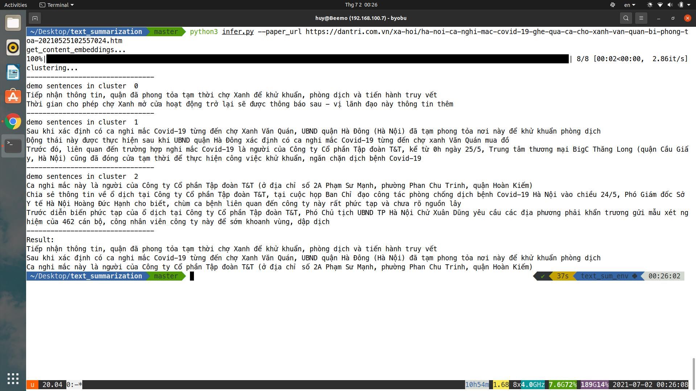
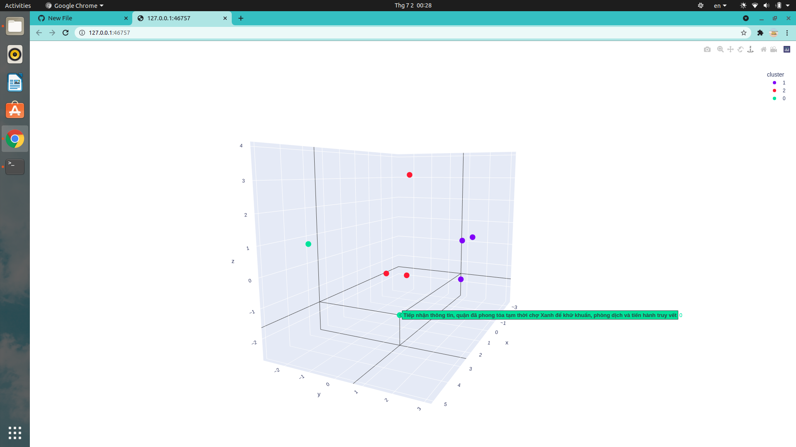

# Text_summarization_kmeans
A project serves as work for Project 2 class.\
It's about generating summarization from text.
# Environment and Libararies
## Environment
This project has [google colab version](https://colab.research.google.com/drive/1waA15669RfGqb-xgEzFod2jkHv-6bm0p) where you can run directly without any configuration.\
On local computer, this is my configuration:
* Ubuntu 20.04
* Python 3.8.10
## Libraries
* I highly recommend that if you are not interested in Machine Learning or Deep Learning, you should create a virtual environment where you can install whatever you want without affecting on local computer's lib. Run this command:
> python3 -m venv env_name

* After creating virtual environment, you have to activate it!
* Now install pytorch (this one is the most important library), run this command to install cpu version of pytorch:
> pip3 install torch==1.9.0+cpu torchvision==0.10.0+cpu torchaudio==0.9.0 -f https://download.pytorch.org/whl/torch_stable.html
* Then install all necessary libraries by running this command:
> pip install -r requirements.txt
# Loading pretrained model
The pretrained model used for this project is paraphrase-xlm-r-multilingual-v1, which was trained on many languages including Vietnamese.
There are 2 ways to load this pretrained model:
- run this command (it can be very slow): 
> python3 load_model.py
- download pretrained model from [driver](https://drive.google.com/drive/folders/1KjKqPWiVY_QNILY-1orAXcxDcHbmfOAb?usp=sharing) and then store it into model directory (recommend)
# Inference
Now you are able to run inference for this project.\
This project supports generarting summarization from content (on some famous papers such as: Dân trí, VnExpress, 24h,...)\
Run thís command:
> python3 infer.py --paper_url PAPER_URL --model_path MODEL_PATH --k K --visualize VISUALIZE
* paper_url is the only one parameter you are required to determine. All the remainings have default settings and you can change it manually.
* model_path is set to model/paraphrase-xlm-r-multilingual-v1 by default
* k (number of summarizing sentences) is set to 3 by default
* visualize (a boolean that returns True if you want to visualize embeddings space) is set to False by default
# Demo:
> python3 infer.py --paper_url https://dantri.com.vn/xa-hoi/ha-noi-ca-nghi-mac-covid-19-ghe-qua-ca-cho-xanh-van-quan-bi-phong-toa-20210525102557024.htm

> python3 infer.py --paper_url https://dantri.com.vn/xa-hoi/ha-noi-ca-nghi-mac-covid-19-ghe-qua-ca-cho-xanh-van-quan-bi-phong-toa-20210525102557024.htm --visualize True

* You get additional visualiztion if set --visualize True
